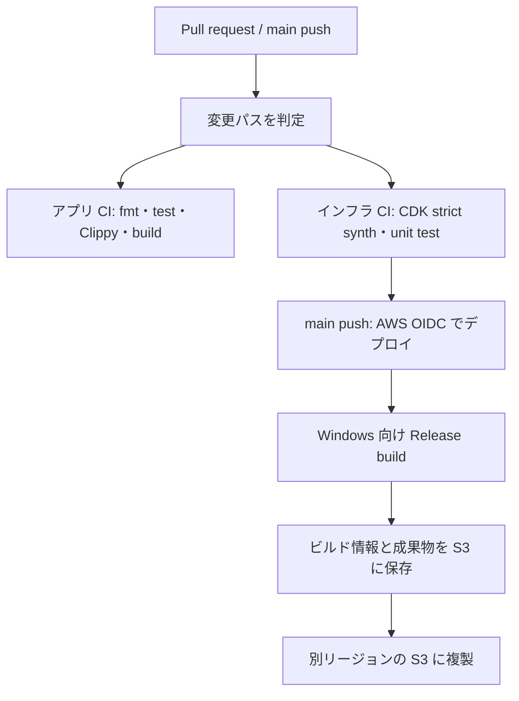

# Bevy開発を支えるCI/CD・AWS基盤

Rust + Bevy のゲーム開発を題材に、開発者が変更を検証し、Windows向けビルド成果物を再現可能な形で保管するための基盤を構築している個人プロジェクトである。

ゲームそのものの機能開発に加え、**開発フロー・テスト・ビルド・成果物管理を整える仕事**に関心がある。ゲーム開発環境エンジニアに必要な技術を、実装と設計記録を通じて学ぶことを目的としている。

> 個人学習プロジェクトであり、業務での運用実績や本番環境での稼働を示すものではない。設定・テスト済みの内容と、実環境での稼働確認は区別している。

## このプロジェクトで取り組んでいること

- Rust / Bevy のゲームコードを、変更時に自動で検証する CI
- AWS CDK（TypeScript）による成果物保管基盤の IaC
- GitHub Actions と AWS を OIDC で接続するデプロイ経路
- Windows 向けビルド成果物とビルド情報の S3 保管
- S3 のアクセスログ、バージョニング、ライフサイクル、クロスリージョンレプリケーション
- インフラを CDK assertions と cdk-nag で検証する仕組み

## CI/CD の流れ



ワークフローは変更パスに応じてアプリとインフラの検証を呼び分ける。AWS へのデプロイと成果物の凍結は、対象ブランチへの push 条件を満たした場合に実行する構成である。

## 実装の要点

### アプリケーション CI

- `cargo fmt -- --check`
- `game_core` / `game_logic` のテストと Clippy
- `--locked` を付けた依存関係の再現可能なチェック・ビルド
- Pull request 時に実行する、デプロイを伴わない検証経路

### AWS 基盤（CDK / TypeScript）

- 成果物用 S3 バケットとアクセスログ用バケット
- パブリックアクセスのブロック、暗号化、HTTPS 強制
- 成果物バケットのバージョニングと保持期間に基づくライフサイクル
- セカンダリリージョンへの S3 クロスリージョンレプリケーション
- GitHub Actions の OIDC 信頼条件をリポジトリとブランチに限定
- cdk-nag の strict synth と CDK assertions による構成テスト

### 成果物ビルド

- `x86_64-pc-windows-msvc` 向け Release ビルド
- `cargo-xwin` を使った GitHub-hosted runner 上のクロスコンパイル
- Git SHA、UTC ビルド時刻、Rust コンパイラ情報、Cargo.lock の SHA-256、crate 名を含むメタデータを作成
- 成果物を S3 に保存し、バケットのレプリケーション設定で別リージョンへ複製

## 技術構成

| 領域 | 使用技術 |
|---|---|
| ゲーム | Rust、Bevy、Cargo workspace |
| IaC | TypeScript、AWS CDK、CloudFormation |
| CI/CD | GitHub Actions、再利用可能 workflow、変更パス判定 |
| AWS | S3、IAM、GitHub OIDC、CloudWatch Logs |
| 検証 | Rust tests、rustfmt、Clippy、Jest、CDK assertions、cdk-nag |
| ローカル再現 | Docker、[act](./.act/README.md) |

## 設計・実装を読む

- [アーキテクチャ](./achitecture.md) — ゲームコードのレイヤー分離と依存方向
- [設計判断・試行錯誤](./design.md) — 仮説、代替案、インフラ設計の記録
- [CI/CD workflow](./.github/workflows/ci.yml) — パス判定と各 workflow の呼び出し
- [アプリ CI](./.github/workflows/app-ci-job.yml)
- [インフラテスト](./.github/workflows/infra-test-job.yml)
- [インフラデプロイ](./.github/workflows/infra-deploy-job.yml)
- [成果物ビルド・保存](./.github/workflows/artifact-job.yml)
- [AWS CDK package](./infra/bevy-platform-infra/README.md)

## ローカルでの確認

Rust の検証:

```bash
cargo fmt -- --check
cargo test -p game_core --locked
cargo test -p game_logic --locked
cargo clippy -p game_core -- -D warnings
cargo clippy -p game_logic -- -D warnings
```

インフラのテストと synth:

```bash
cd infra/bevy-platform-infra
npm ci
npm test
npm run synth -- BevyPlatformInfraStack --strict -c env=dev
```

GitHub Actions のローカル再現には Docker と `act` を使う。実行方法と必要な環境変数は [act 利用ガイド](./.act/README.md) を参照。AWS デプロイには AWS 側の設定と認証が必要である。

## 現時点の範囲と次の検証

CodeBuild については、将来のビルド移行に備えた IAM サービスロールを定義している段階であり、現在のビルド workflow から CodeBuild の `StartBuild` は呼び出していない。また、この README の更新時点では、AWS 上での継続運用実績やビルド時間短縮などの定量値は提示していない。今後は実環境でのデプロイ・復旧手順を検証し、実測値と運用上の課題を記録する。

## 関連資料

- [開発への参加方法](./CONTRIBUTING.md)
