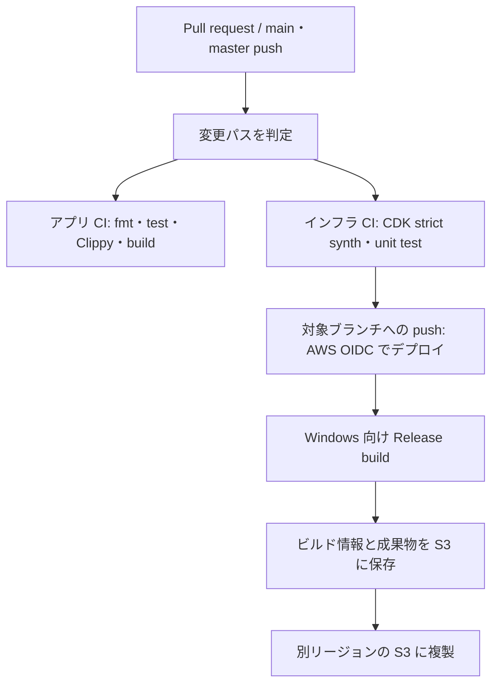

# Bevy開発を支えるCI/CD・AWS基盤

Rust + Bevy のゲーム開発を題材に、開発者が変更を検証し、Windows向けビルド成果物を再現可能な形で保管するための基盤を構築・検証した個人プロジェクトである。

ゲームそのものの機能開発に加え、**開発フロー・テスト・ビルド・成果物管理を整える仕事**に関心がある。ゲーム開発環境エンジニアに必要な技術を、実装と設計記録を通じて学ぶことを目的としている。

> 個人学習プロジェクトであり、商用本番環境での運用実績、SLA、長期間の継続運用実績、大人数チームでの運用実績を示すものではない。設定・テスト済みの内容と、実 AWS 環境で確認した内容は区別して記載する。

## Phase 1 完了: CI/CD + AWS artifact infrastructure

Phase 1 では、Rust / Bevy の変更検証から AWS へのインフラデプロイ、Windows 向け成果物の S3 保管までを一つの CI/CD 経路として実装した。2026-10-02 に、新しい AWS アカウントの初期構築・復旧と GitHub Actions の E2E を実 AWS 環境で確認済みである。

この時点を Phase 1 の完成点とし、追加開発は一旦停止する。将来の拡張候補は、後述の「今後の候補」に分けている。

## このプロジェクトで取り組んでいること

- Rust / Bevy のゲームコードを、変更時に自動で検証する CI
- AWS CDK（TypeScript）による成果物保管基盤の IaC
- GitHub Actions と AWS を OIDC で接続するデプロイ経路
- Windows 向けビルド成果物とビルド情報の S3 保管
- S3 のアクセスログ、バージョニング、ライフサイクル、クロスリージョンレプリケーション
- インフラを CDK assertions と cdk-nag で検証する仕組み

## CI/CD の流れ



ワークフローは変更パスに応じてアプリとインフラの検証を呼び分ける。AWS へのデプロイと成果物の凍結は、対象ブランチへの push 条件を満たした場合に実行する構成である。

## 実装の要点

### アプリケーション CI

- `cargo fmt -- --check`
- `game_core` / `game_logic` のテストと Clippy
- `--locked` を付けた依存関係の再現可能なチェック・ビルド
- Pull request と対象ブランチへの push で実行する検証経路

### AWS 基盤（CDK / TypeScript）

- 成果物用 S3 バケットとアクセスログ用バケット
- パブリックアクセスのブロック、暗号化、HTTPS 強制
- 成果物バケットのバージョニングと保持期間に基づくライフサイクル
- セカンダリリージョンへの S3 クロスリージョンレプリケーション
- GitHub Actions の OIDC 信頼条件をリポジトリとブランチに限定
- cdk-nag の strict synth と CDK assertions による構成テスト

### 成果物ビルド

- `x86_64-pc-windows-msvc` 向け Release ビルド
- `cargo-xwin` を使った GitHub-hosted runner 上のクロスコンパイル
- Git SHA、UTC ビルド時刻、Rust コンパイラ情報、Cargo.lock の SHA-256、crate 名を含むメタデータを作成
- 成果物を S3 に保存し、バケットのレプリケーション設定で別リージョンへ複製

## 技術構成

| 領域 | 使用技術 |
|---|---|
| ゲーム | Rust、Bevy、Cargo workspace |
| IaC | TypeScript、AWS CDK、CloudFormation |
| CI/CD | GitHub Actions、再利用可能 workflow、変更パス判定 |
| AWS | S3、IAM、GitHub OIDC、CloudWatch Logs |
| 検証 | Rust tests、rustfmt、Clippy、Jest、CDK assertions、cdk-nag |
| ローカル再現 | Docker、[act](./.act/README.md) |

## 設計・実装を読む

- [アーキテクチャ](./architecture.md) — ゲームコードのレイヤー分離と依存方向
- [設計判断・試行錯誤](./design.md) — 仮説、代替案、インフラ設計の記録
- [CI/CD workflow](./.github/workflows/ci.yml) — パス判定と各 workflow の呼び出し
- [アプリ CI](./.github/workflows/app-ci-job.yml)
- [インフラテスト](./.github/workflows/infra-test-job.yml)
- [インフラデプロイ](./.github/workflows/infra-deploy-job.yml)
- [成果物ビルド・保存](./.github/workflows/artifact-job.yml)
- [AWS CDK package](./infra/bevy-platform-infra/README.md)

## ローカルでの確認

Rust の検証:

```bash
cargo fmt -- --check
cargo test -p game_core --locked
cargo test -p game_logic --locked
cargo clippy -p game_core -- -D warnings
cargo clippy -p game_logic -- -D warnings
```

インフラのテストと synth:

```bash
cd infra/bevy-platform-infra
npm ci
npm test
CDK_DEFAULT_ACCOUNT=123456789012 npm run synth -- BevyPlatformInfraStack --strict -c env=dev
```

GitHub Actions のローカル再現には Docker と `act` を使う。実行方法と必要な環境変数は [act 利用ガイド](./.act/README.md) を参照。AWS デプロイには AWS 側の設定と認証が必要である。

## 新しい AWS アカウントの初期構築・復旧

初回の端末セットアップでは GitHub CLI を認証する。

```bash
gh auth login
```

新しい AWS アカウントを用意した後は、AWS CLI で人間が初回認証し、リポジトリルートで bootstrap スクリプトを実行する。指定する profile は、AWS CLI で認証済みで、CDK bootstrap / deploy と構築結果の検証に必要な権限を持つ管理用 profile とする。通常作業に root user は使用しない。

```bash
aws login --profile <admin-profile>

./script/bootstrap-aws-account.sh \
  --profile <admin-profile> \
  --dry-run

./script/bootstrap-aws-account.sh \
  --profile <admin-profile>
```

スクリプトは認証済み profile から AWS Account ID を取得し、次の順序で初期構築と検証を行う。

```text
AWS account
↓
人間による初回認証
↓
script/bootstrap-aws-account.sh
↓
ap-northeast-1 / us-east-1 の CDK bootstrap
↓
セカンダリ・プライマリスタックのデプロイ
↓
GitHub repository variables / AWS_ROLE_ARN secret の設定
↓
AWS / GitHub configuration verification
```

`--dry-run` は対象 AWS account、repository、branch、CDK environment と実行予定を表示し、AWS、GitHub、依存関係を変更しない。実行本体は再実行可能であり、2リージョンの `CDKToolkit`、CloudFormation stacks、GitHub OIDC Provider / IAM Role、repository variables / secret を最後に検証する。

AWS Access Key / Secret Access Key を作成することは標準手順に含めない。GitHub-hosted runner 上の GitHub Actions は、長期認証情報ではなく GitHub OIDC で IAM Role を引き受け、一時認証情報を使用する。

## 実 AWS 環境での検証結果

2026-10-02 の [GitHub Actions run #66（ID: 37017781536）](https://github.com/sasakisenhi/Bevy_AWS_lesson/actions/runs/37017781536) で、次の E2E 経路が成功した。

```text
GitHub push
↓
Application / Infrastructure CI
↓
GitHub OIDC
↓
AWS IAM Role
↓
CDK bootstrap verification
↓
CDK diff / deploy
↓
Windows x86_64-pc-windows-msvc Release build
↓
S3 Artifact Freeze
```

この run では、変更パス判定、rustfmt、unit tests、Clippy、workspace 内の対象 crate の build、CDK strict synth / cdk-nag、Jest / CDK assertions、`AssumeRoleWithWebIdentity`、2リージョンの bootstrap resource verification、CDK diff / deploy、CloudFormation Outputs からの artifact bucket 解決、S3 access check、artifact upload、staging update、metrics generation / upload まで、実際の GitHub Actions と AWS 環境で成功した。

新しい AWS アカウントの初期構築・復旧についても、人間による初回認証から `script/bootstrap-aws-account.sh`、2リージョンの CDK bootstrap、インフラデプロイ、GitHub repository variables / secret の設定、AWS / GitHub configuration verification までを実 AWS 環境で確認済みである。

## Phase 1 の範囲

実装・検証済みの範囲は次のとおりである。

- Rust / Bevy CI（rustfmt、unit tests、Clippy、対象 crate の build）
- `x86_64-pc-windows-msvc` 向け Windows Release cross build
- GitHub Actions reusable workflows と変更パス判定
- AWS CDK による IaC と infrastructure tests
- GitHub OIDC による一時認証
- 2リージョンの CDK bootstrap と CloudFormation deployment
- S3 artifact storage とクロスリージョンレプリケーション構成
- Artifact Freeze、staging update、build metrics の生成・保存
- 新しい AWS アカウントの bootstrap / recovery
- GitHub repository variables / `AWS_ROLE_ARN` secret の設定・検証

CodeBuild は、将来の移行に備えた IAM service role だけを CDK で定義している。CodeBuild project は定義しておらず、現行 workflow は GitHub-hosted runner で build し、CodeBuild `StartBuild` を呼び出さない。

## 今後の候補

次の項目は Phase 1 の完成条件には含めず、今回は実装しない。

- CodeBuild の実利用
- build time / cache hit rate の継続計測と傾向分析
- 複数開発者向けの権限設計
- disaster recovery / failure injection の演習
- 共通ゲーム開発環境への発展

## 関連資料

- [開発への参加方法](./CONTRIBUTING.md)
